# AI Agent with Azure API Management & Azure AI Search

This enterprise-ready solution deploys an AI-powered API gateway that combines Azure API Management, Azure AI Services, and Azure AI Search to create a production-grade conversational AI platform with enterprise security, rate limiting, and intelligent knowledge retrieval.

---

**[SOLUTION OVERVIEW](#solution-overview)** | **[ARCHITECTURE](#architecture)** | **[GETTING STARTED](#getting-started)** | **[API ENDPOINTS](#api-endpoints)** | **[OTHER FEATURES](#other-features)** | **[RESOURCE CLEAN-UP](#resource-clean-up)** | **[GUIDANCE](#guidance)** | **[TROUBLESHOOTING](#troubleshooting)**

---

## Solution Overview

This solution deploys an **enterprise-grade AI-powered API gateway** that combines Azure API Management (APIM) with Azure AI Services and Azure AI Search to create a production-ready conversational AI platform.

The solution leverages **Azure AI Agent service** integrated with **Azure AI Search** for intelligent knowledge retrieval from uploaded files, enabling it to generate contextually-aware responses with citations. The API gateway provides enterprise-level security, rate limiting, and monitoring capabilities while the AI agent delivers intelligent search-enhanced responses.

### 🚀 Enterprise Features

- **🔐 API Gateway Security**: Subscription key authentication and rate limiting (100 calls/min, 1000 calls/hour)
- **🔍 Intelligent Search**: Azure AI Search with semantic search and vector embeddings for enhanced RAG capabilities  
- **⚡ High Performance**: Container Apps with auto-scaling and managed identity for secure Azure service access
- **📊 Complete Monitoring**: Application Insights integration with request tracing and performance metrics
- **🏢 Production Ready**: Enterprise-grade architecture with proper security, scaling, and governance

### 🎯 Key Capabilities

- **RAG-Enhanced AI Responses**: Combines Azure AI Search results with GPT-4o-mini for contextually-aware answers
- **Enterprise API Management**: Full APIM integration with subscription management, rate limiting, and request transformation
- **Secure Authentication**: API key-based access control with Azure managed identity for backend services
- **Scalable Architecture**: Container Apps deployment with automatic scaling based on demand
- **Rich Data Sources**: Support for product information, customer data, and custom document uploads

## Architecture

### Enterprise API Gateway Architecture

```mermaid
graph TB
    A[External Clients] --> B[Azure API Management]
    B --> C[Container App - FastAPI]
    B --> D[Rate Limits<br/>• 100/min<br/>• 1000/hour]
    C --> E[Azure AI Services<br/>GPT-4o-mini]
    C --> F[Azure AI Search<br/>RAG Data]
    
    style A fill:#e1f5fe
    style B fill:#f3e5f5
    style C fill:#e8f5e8
    style E fill:#fff3e0
    style F fill:#fff8e1
```




### Request Flow

1. **Client Request** → APIM Gateway validates subscription key and applies rate limits
2. **APIM Processing** → Request transformation, logging, and routing to Container App  
3. **AI Agent Processing** → FastAPI receives request and queries Azure AI Search for context
4. **RAG Enhancement** → Search results combined with user query for AI processing
5. **AI Response** → GPT-4o-mini generates contextually-aware response using retrieved knowledge
6. **Response Delivery** → Formatted response returned through APIM to client

### Key Features

- **🔐 Enterprise API Gateway**  
  Azure API Management provides enterprise-grade security with subscription key authentication, rate limiting (100 calls/min, 1000 calls/hour), request transformation, and comprehensive monitoring.

- **🔍 Enhanced Knowledge Retrieval**  
  Azure AI Search integration with semantic search capabilities, vector embeddings, and intelligent document retrieval for superior RAG (Retrieval-Augmented Generation) performance.

- **⚡ High-Performance AI Models**  
  Optimized GPT-4o-mini deployment with customizable capacity and text-embedding-3-small for vector search, providing fast and cost-effective AI responses.

- **🏗️ Production-Ready Architecture**  
  Container Apps deployment with auto-scaling, managed identity security, private networking, and enterprise-grade monitoring and observability.

- **📊 Complete Observability**  
  Integrated Application Insights, Log Analytics, health checks, and APIM analytics for comprehensive monitoring, debugging, and performance optimization.

- **🔄 CI/CD Ready**  
  Azure Developer CLI (azd) integration with GitHub Actions support, infrastructure as code with Bicep, and automated deployment pipelines.

- **🛡️ Security & Compliance**  
  Role-based access control (RBAC), managed identity for service-to-service authentication, network security, and enterprise security best practices.

- **📈 Agent Evaluation & Testing**  
  Built-in evaluation capabilities for agent performance monitoring and quality assurance during development and production.

- **🔴 AI Red Teaming**  
  Automated security and safety scanning capabilities to assess risk posture before production deployment.

---

Here is a screenshot showing the chatting web application with requests and responses between the system and the user:


## Getting Started

### Quick Deploy

| **GitHub Codespaces** | **Dev Containers** |
|---|---|
| [](https://codespaces.new/Azure-Samples/get-started-with-ai-agents) | [](https://vscode.dev/redirect?url=vscode://ms-vscode-remote.remote-containers/cloneInVolume?url=https://github.com/Azure-Samples/get-started-with-ai-agents) |

GitHub Codespaces and Dev Containers both allow you to download and deploy the code for development. You can also continue with local development. Once you have selected your environment, [click here to launch the development and deployment guide](./docs/deployment.md)

**After deployment, try these [sample questions](./docs/sample_questions.md) to test your agent.**

## API Endpoints

### 🔗 APIM Gateway Endpoints

Your deployed solution provides the following API endpoints through Azure API Management:

#### **Base URL**: `https://apim-{resourceToken}.azure-api.net`

| Endpoint | Method | Description | Authentication |
|----------|---------|-------------|----------------|
| `/aiagent/health` | GET | Health check endpoint | Subscription Key |
| `/aiagent/chat` | POST | Main chat interface with AI agent | Subscription Key |
| `/aiagent/` | GET | Web interface (if enabled) | Subscription Key |

#### **Authentication**
All API calls require the `Ocp-Apim-Subscription-Key` header with your subscription key.

#### **Rate Limits**
- **Per Minute**: 100 requests
- **Per Hour**: 1000 requests

#### **Example Usage**

```bash
# Health Check
curl -X GET "https://apim-{resourceToken}.azure-api.net/aiagent/health" \
  -H "Ocp-Apim-Subscription-Key: YOUR_SUBSCRIPTION_KEY"

# Chat Request
curl -X POST "https://apim-{resourceToken}.azure-api.net/aiagent/chat" \
  -H "Ocp-Apim-Subscription-Key: YOUR_SUBSCRIPTION_KEY" \
  -H "Content-Type: application/json" \
  -d '{
    "message": "What products do you offer?",
    "thread_id": "optional-thread-id"
  }'
```

#### **Response Format**
```json
{
  "response": "AI-generated response with search context",
  "agent_id": "agent-template-assistant",
  "thread_id": "conversation-thread-id",
  "citations": ["source1.md", "source2.json"]
}
```

### 🎯 Getting Your Subscription Key

1. Navigate to the **Azure Portal** → **API Management** → `apim-{resourceToken}`
2. Go to **Subscriptions** in the left menu
3. Find your subscription and click **Show/hide keys**
4. Copy the **Primary key** for API authentication


## Other Features

Once you have the agents and the web app working, you are encouraged to try one of the following:

- **[Tracing and Monitoring](./docs/other_features.md#tracing-and-monitoring)** - View console logs in Azure portal and App Insights tracing in Azure AI Foundry for debugging and performance monitoring.

- **[Agent Evaluation](./docs/other_features.md#agent-evaluation)** - Evaluate your agent's performance and quality using built-in evaluators for local development, continuous monitoring, and CI/CD integration.

- **[AI Red Teaming Agent](./docs/other_features.md#ai-red-teaming-agent)** - Run automated security and safety scans on your agent solution to check your risk posture before production deployment.

## Resource Clean-up

To prevent incurring unnecessary charges, it's important to clean up your Azure resources after completing your work with the application.

- **When to Clean Up:**
  - After you have finished testing or demonstrating the application.
  - If the application is no longer needed or you have transitioned to a different project or environment.
  - When you have completed development and are ready to decommission the application.

- **Deleting Resources:**  
  To delete all associated resources and shut down the application, execute the following command:
  
  ```bash
  azd down
  ```

  Please note that this process may take up to 20 minutes to complete.

⚠️ **Alternative:** You can delete the resource group directly from the Azure Portal to clean up resources.

## Guidance

### Costs

Pricing varies per region and usage, so it isn't possible to predict exact costs for your usage.
The majority of the Azure resources used in this infrastructure are on usage-based pricing tiers.

You can try the [Azure pricing calculator](https://azure.microsoft.com/pricing/calculator) for the resources:

- **Azure API Management**: Developer tier. [Pricing](https://azure.microsoft.com/pricing/details/api-management/)
- **Azure AI Search**: Basic tier with semantic search (free). [Pricing](https://azure.microsoft.com/pricing/details/search/)
- **Azure AI Foundry**: Free tier. [Pricing](https://azure.microsoft.com/pricing/details/ai-studio/)  
- **Azure Storage Account**: Standard tier, LRS. Pricing is based on storage and operations. [Pricing](https://azure.microsoft.com/pricing/details/storage/blobs/)  
- **Azure AI Services**: S0 tier, defaults to gpt-4o-mini. Pricing is based on token count. [Pricing](https://azure.microsoft.com/pricing/details/cognitive-services/)  
- **Azure Container App**: Consumption tier with 0.5 CPU, 1GiB memory/storage. Pricing is based on resource allocation, and each month allows for a certain amount of free usage. [Pricing](https://azure.microsoft.com/pricing/details/container-apps/)  
- **Log analytics**: Pay-as-you-go tier. Costs based on data ingested. [Pricing](https://azure.microsoft.com/pricing/details/monitor/)  
- **Agent Evaluations**: Incurs the cost of your provided model deployment used for local evaluations.  
- **AI Red Teaming Agent**: Leverages Azure AI Risk and Safety Evaluations to assess attack success from the automated AI red teaming scan. Users are billed based on the consumption of Risk and Safety Evaluations as listed in [our Azure pricing page](https://azure.microsoft.com/pricing/details/ai-foundry/). Click on the tab labeled “Complete AI Toolchain” to view the pricing details.

⚠️ To avoid unnecessary costs, remember to take down your app if it's no longer in use,
either by deleting the resource group in the Portal or running `azd down`.

### Security guidelines

This template also uses [Managed Identity](https://learn.microsoft.com/entra/identity/managed-identities-azure-resources/overview) for local development and deployment.

To ensure continued best practices in your own repository, we recommend that anyone creating solutions based on our templates ensure that the [Github secret scanning](https://docs.github.com/code-security/secret-scanning/about-secret-scanning) setting is enabled.

You may want to consider additional security measures, such as:

- Enabling Microsoft Defender for Cloud to [secure your Azure resources](https://learn.microsoft.com/azure/defender-for-cloud/).
- Protecting the Azure Container Apps instance with a [firewall](https://learn.microsoft.com/azure/container-apps/waf-app-gateway) and/or [Virtual Network](https://learn.microsoft.com/azure/container-apps/networking?tabs=workload-profiles-env%2Cazure-cli).

> **Important Security Notice**  
> This template, the application code and configuration it contains, has been built to showcase Microsoft Azure specific services and tools. We strongly advise our customers not to make this code part of their production environments without implementing or enabling additional security features.  
>   
> For a more comprehensive list of best practices and security recommendations for Intelligent Applications, [visit our official documentation](https://learn.microsoft.com/en-us/azure/ai-foundry/).

### Resources

This template creates a complete enterprise AI platform with the following Azure resources:

| Resource | Description | Key Features |
|----------|-------------|--------------|
| [Azure API Management](https://learn.microsoft.com/azure/api-management/) | **Enterprise API Gateway** - Provides secure API access with authentication, rate limiting, and monitoring | • Subscription key authentication<br/>• Rate limiting (100/min, 1000/hour)<br/>• Request/response transformation<br/>• Developer portal |
| [Azure AI Project](https://learn.microsoft.com/azure/ai-studio/how-to/create-projects) | **AI Development Hub** - Collaborative workspace for AI development with access to models, data, and compute resources | • Model deployment management<br/>• Agent orchestration<br/>• Connection management |
| [Azure AI Search](https://learn.microsoft.com/azure/search/) | **Intelligent Search Service** - Provides semantic search, vector search, and hybrid search capabilities for RAG | • Semantic search (free tier)<br/>• Vector embeddings<br/>• Full-text search<br/>• Index management |
| [Azure OpenAI Service](https://learn.microsoft.com/azure/ai-services/openai/) | **AI Model Hosting** - Powers the AI agents with GPT-4o-mini and text-embedding-3-small models | • GPT-4o-mini for chat completion<br/>• text-embedding-3-small for vectors<br/>• Customizable model capacity |
| [Azure Container Apps](https://learn.microsoft.com/azure/container-apps/) | **Scalable Backend** - Hosts and scales the FastAPI web application with serverless containers | • Auto-scaling<br/>• Managed identity<br/>• Private networking<br/>• Health monitoring |
| [Azure Container Registry](https://learn.microsoft.com/azure/container-registry/) | **Container Management** - Stores and manages container images for secure deployment | • Private registry<br/>• Image scanning<br/>• Geo-replication support |
| [Storage Account](https://learn.microsoft.com/azure/storage/blobs/) | **Data Storage** - Provides blob storage for application data, file uploads, and AI model artifacts | • Blob storage<br/>• File shares<br/>• Queue storage<br/>• Table storage |
| [Application Insights](https://learn.microsoft.com/azure/azure-monitor/app/app-insights-overview) | **APM & Monitoring** - Application performance monitoring, logging, and telemetry for debugging | • Request tracing<br/>• Performance metrics<br/>• Error tracking<br/>• Custom telemetry |
| [Log Analytics Workspace](https://learn.microsoft.com/azure/azure-monitor/logs/log-analytics-workspace-overview) | **Centralized Logging** - Collects and analyzes telemetry data for monitoring and troubleshooting | • Centralized logging<br/>• Query capabilities (KQL)<br/>• Alerting<br/>• Dashboard integration |

## Troubleshooting

### Provisioning and Deployment Failures

- If you have an issue is with timeouts or provisioning resources, changing the location of your resource group can help, as there may be availability constrains for resources. Call `azd down` and remove your current resources, and delete the `.azure` folder from your workspace. Then, call `azd up` again and select a different region.

- You may debug further using [azd commands](https://learn.microsoft.com/azure/developer/azure-developer-cli/reference#azd-deploy). `azd show` displays information abour your app and resources, and `azd deploy --debug` enables debugging and logging while deploying the application's code to Azure.
- Ensure that your az and azd tools are up to date.
- After fully deploying with azd, additional errors in the Azure Portal may indicate that your latest code has not been successfully deployed

### Azure Container Apps

- If your ACA does not boot up, it is possible that your deployment has failed. This could be due to quota constraints, permission issues, or resource availability. Check failures in the deployment and container app logs in the Azure Portal.

- Console traces in ACA can be found in the Azure Portal, but they may be unreliable. Use Python’s logging with INFO level, and adjust Azure HTTP logging to WARNING.
- Once your ACA is deployed, utilize the browser debugger (F12) and clear cache (CTRL+SHIFT+R). This can help debug the frontend for better traceability.

#### Azure API Management

- **Subscription Key Issues**: If you receive 401 errors, verify your subscription key is correct and included in the `Ocp-Apim-Subscription-Key` header. You can find your subscription key in the Azure Portal under API Management → Subscriptions.

- **Rate Limiting**: If you receive 429 errors, you've exceeded the rate limits (100/min or 1000/hour). Wait for the rate limit window to reset or contact your administrator to increase limits.

- **APIM Gateway Errors**: Check the APIM Analytics in Azure Portal for request logs and error details. Verify that the backend Container App is healthy by testing the direct Container App URL.

- **Subscription Management**: If you need additional subscriptions or different rate limits, navigate to the APIM Developer Portal or Azure Portal to manage subscriptions and products.

#### Azure AI Search

- **Search Service Not Available**: Verify that `USE_AZURE_AI_SEARCH_SERVICE=true` environment variable is set and that the search service has been deployed successfully. Check the deployment logs for any search service provisioning errors.

- **Index Not Found**: Ensure your search index has been created and populated. Check the search service in Azure Portal and verify the index exists with the expected schema.

- **Search Performance**: If search responses are slow, check the search service tier and consider upgrading from Basic to Standard for better performance. Monitor search service metrics in Azure Portal.

- **Vector Search Issues**: Verify that embeddings are being generated correctly and that the vector fields are properly configured in your search index schema.

#### Agents

- If your agent is occasionally unresponsive, your model may have reached its rate limit. You can increase its quota by adjusting the bicep configuration or by editing the model in the Azure AI Foundry page for your project's model deployments.

- If your agent is crashing, confirm that you are using a model that you have deployed to your project.
- This application is designed to serve multiple users on multiple browsers. This application uses cookies to ensure that the same thread is reused for conversations across multiple tabs in the same browser. If the browser is restarted, the old thread will continue to serve the user. However, if the application has a new agent after a server restart or a thread is deleted, a new thread will be created without requiring a browser refresh or signaling to the users. When users submit a message to the web server, the web server will create an agent, thread, and stream back a reply. The response contains `agent_id` and `thread_id` in cookies. As a result, each subsequent message sent to the web server will also contain these IDs. As long as the same agent is being used in the system and the thread can be retrieved in the cookie, the same thread will be used to serve the users.
- For document handling, use filename-based downloads to avoid storing files in dictionaries.
- Intermittent errors may arise when retrieving filenames for file IDs, which may be mitigated by using a single worker and fresh threads for each new agent.
- File citation can be enhanced by automatically including filenames to reduce manual steps.

## Disclaimers

To the extent that the Software includes components or code used in or derived from Microsoft products or services, including without limitation Microsoft Azure Services (collectively, “Microsoft Products and Services”), you must also comply with the Product Terms applicable to such Microsoft Products and Services. You acknowledge and agree that the license governing the Software does not grant you a license or other right to use Microsoft Products and Services. Nothing in the license or this ReadMe file will serve to supersede, amend, terminate or modify any terms in the Product Terms for any Microsoft Products and Services.

You must also comply with all domestic and international export laws and regulations that apply to the Software, which include restrictions on destinations, end users, and end use. For further information on export restrictions, visit <https://aka.ms/exporting>.

You acknowledge that the Software and Microsoft Products and Services (1) are not designed, intended or made available as a medical device(s), and (2) are not designed or intended to be a substitute for professional medical advice, diagnosis, treatment, or judgment and should not be used to replace or as a substitute for professional medical advice, diagnosis, treatment, or judgment. Customer is solely responsible for displaying and/or obtaining appropriate consents, warnings, disclaimers, and acknowledgements to end users of Customer’s implementation of the Online Services.

You acknowledge the Software is not subject to SOC 1 and SOC 2 compliance audits. No Microsoft technology, nor any of its component technologies, including the Software, is intended or made available as a substitute for the professional advice, opinion, or judgement of a certified financial services professional. Do not use the Software to replace, substitute, or provide professional financial advice or judgment.  

BY ACCESSING OR USING THE SOFTWARE, YOU ACKNOWLEDGE THAT THE SOFTWARE IS NOT DESIGNED OR INTENDED TO SUPPORT ANY USE IN WHICH A SERVICE INTERRUPTION, DEFECT, ERROR, OR OTHER FAILURE OF THE SOFTWARE COULD RESULT IN THE DEATH OR SERIOUS BODILY INJURY OF ANY PERSON OR IN PHYSICAL OR ENVIRONMENTAL DAMAGE (COLLECTIVELY, “HIGH-RISK USE”), AND THAT YOU WILL ENSURE THAT, IN THE EVENT OF ANY INTERRUPTION, DEFECT, ERROR, OR OTHER FAILURE OF THE SOFTWARE, THE SAFETY OF PEOPLE, PROPERTY, AND THE ENVIRONMENT ARE NOT REDUCED BELOW A LEVEL THAT IS REASONABLY, APPROPRIATE, AND LEGAL, WHETHER IN GENERAL OR IN A SPECIFIC INDUSTRY. BY ACCESSING THE SOFTWARE, YOU FURTHER ACKNOWLEDGE THAT YOUR HIGH-RISK USE OF THE SOFTWARE IS AT YOUR OWN RISK.
# get-started-with-ai-agents-with-apim

